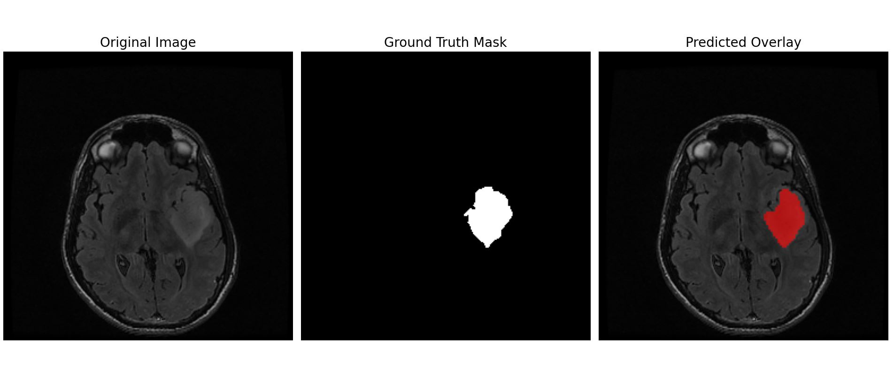
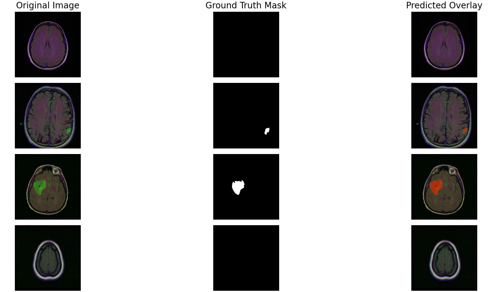

# U-Net for Brain Tumor Segmentation (LGG-MRI)

This project is a **PyTorch** implementation of the **U-Net** architecture, trained for semantic segmentation of Lower-Grade Glioma (LGG) tumors from brain MRI images.

The model was trained on the [LGG MRI Segmentation Dataset on Kaggle](https://www.kaggle.com/datasets/mateuszbuda/lgg-mri-segmentation/data).

---

## The U-Net Architecture


**U-Net** is a convolutional neural network (CNN) architecture developed in 2015 specifically for biomedical image segmentation. Its architecture consists of two main paths:

1.  **The Contracting Path (Encoder):** A standard stack of convolution and max-pooling layers to capture context and extract features from the image.
2.  **The Expansive Path (Decoder):** A series of up-convolutions and convolutions that allows the network to precisely localize features and reconstruct the image back to its original dimensions.

The key feature of U-Net is the **"Skip Connections"**. These connections concatenate feature maps from the encoder path directly to the corresponding layers in the decoder path. This allows the network to recover fine-grained details and spatial information that would otherwise be lost during encoding, resulting in high-precision segmentation masks.

---

## Model Performance

After training (e.g., for 20 epochs), the model achieved the following results on the validation set:

* **Dice Score:** `0.83`
* **Pixel-wise Accuracy:** `99.75%`

### Sample Predictions

Below are sample predictions on images from the validation set. The columns represent the **Original MRI**, **Ground Truth Mask**, and **Model's Prediction**, respectively.




---

## Getting Started

Follow these steps to run the project on your local machine.

1.  **Clone the repository:**
    ```bash
    git clone https://github.com/nimabgr/UNet-Brain-Tumor-Segmentation.git
    cd UNet-Brain-Tumor-Segmentation
    ```

2.  **Install the required libraries:**
    ```bash
    pip install -r requirements.txt
    ```

3.  **Set up the Dataset:**
    Download the [LGG MRI Segmentation Dataset](https://www.kaggle.com/datasets/mateuszbuda/lgg-mri-segmentation/data) from Kaggle.
    Create a folder named dataset in the root of the project.
    Unzip the downloaded file and move all the individual patient folders (e.g., TCGA_CS_4941..., TCGA_CS_4942..., etc.) directly into the dataset folder.

4.  **Run Training:**
    Execute the main training script. This will start the training process and save the model checkpoint (my_checkpoint.pth.tar) and output images (saved_images/).
    ```bash
    python train.py
    ```

---

## Acknowledgments
The foundational understanding and implementation of the U-Net architecture for this project were learned from **Aladdin Persson's** excellent YouTube tutorial. His video serves as a clear guide to building U-Net with PyTorch.

While the tutorial demonstrates the model on the Carvana (car segmentation) dataset, this project applies those learned concepts to a new and different domain: **brain tumor segmentation (LGG-MRI)**.


